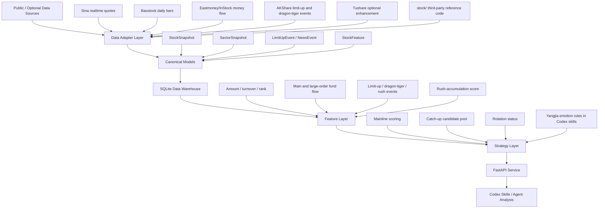

# Rich A-share Rotation Agent Architecture

This project is a research-only A-share market analysis system for short-term
capital rotation, mainline recognition, and catch-up candidate discovery. It
does not place orders and must not be treated as investment advice.

## Product Boundary

- The system supports market research and decision support only.
- It does not include brokerage login, order execution, or guaranteed-return
  logic.
- Leaders are observation symbols for judging sector strength, not automatic
  buy candidates.
- Every strategy output should preserve timestamps, evidence, risks, trigger
  conditions, invalidation conditions, and data-quality caveats.

## High-Level Flow



## Repository Layout

| Path | Purpose |
|---|---|
| `packages/ashare_agent/models.py` | Pydantic boundary models for snapshots, events, features, and strategy outputs. |
| `packages/ashare_agent/data_sources/` | Provider adapters for AKShare, Sina, Baostock, Eastmoney/InStock, Tushare, SQLite, and mock fallback. |
| `packages/ashare_agent/storage/sqlite_store.py` | SQLite schema, persistence, quality checks, and latest-data query helpers. |
| `packages/ashare_agent/strategy/scoring.py` | Mainline, leader, catch-up, rotation, and mock backtest logic. |
| `packages/ashare_agent/strategy/features.py` | Derived stock features and rush-accumulation event generation. |
| `packages/ashare_agent/apps/api/main.py` | FastAPI service endpoints. |
| `packages/ashare_agent/apps/mcp_server/server.py` | MCP tools for Codex integration. |
| `packages/ashare_agent/scripts/sync_market_data.py` | CLI data sync orchestration. |
| `.agents/skills/` | Repository-scoped Codex skills for data sync, sector review, daily review, and backtest checks. |
| `.agents/skills/references/yangjia-emotion-framework.md` | Local trading-method reference used by analysis skills. |
| `stock/` | Third-party reference code and data-channel research assets from the InStock ecosystem. |
| `scripts/rich-service.sh` | Linux service helper for install, start, stop, restart, logs, and sync. |
| `tests/` | Focused tests for providers, storage, features, and strategy behavior. |

## Data Sources

| Source | Current Use | Notes |
|---|---|---|
| Sina | Realtime quote snapshots for selected symbols. | Useful for watchlist refresh. |
| Baostock | Daily bars and historical stock snapshots. | Free historical baseline. |
| Eastmoney/InStock adapter | Stock and sector money flow. | Current validated free money-flow path; may require `EASTMONEY_COOKIE` or proxy. |
| AKShare | Limit-up pool and dragon-tiger list. | Dragon-tiger is after-close evidence only. |
| Tushare | Optional stock and sector money-flow enhancement. | Requires `TUSHARE_TOKEN`. |
| Mock provider | Development fallback. | Must be labeled as mock and low confidence. |

## SQLite Warehouse

The default database is `data/rich.sqlite3`. Runtime data is intentionally not
committed to git.

Core tables:

- `stock_snapshots`
- `stock_realtime_quotes`
- `stock_moneyflow`
- `sector_snapshots`
- `sector_membership`
- `limit_up_events`
- `news_events`
- `stock_features`

`/data/quality` reports row counts, latest timestamps, feature/event coverage,
confidence ceiling, and blockers.

## Feature Layer

The feature layer derives comparable fields from quote and money-flow data:

- Amount rank and percentile.
- Main-net-inflow rank and percentile.
- Main-net-inflow to amount ratio.
- Rush-accumulation score.
- Derived `rush_accumulation` events.

These features are research signals, not deterministic trade instructions.

## Strategy Layer

The strategy layer keeps provider logic separate from strategy logic. It reads
from the `MarketDataProvider` contract and produces typed outputs:

- `MainlineScore`
- `LeaderCandidate`
- `CatchupCandidate`
- `RotationStatus`
- `MarketOverview`
- `BacktestResult`

Current implemented behavior:

- Mainline scoring by sector return, money flow, amount heat, limit-up ladder,
  leader strength, and tail support.
- Catch-up candidate scoring with risks, triggers, and invalidation conditions.
- Rotation comparison between strongest and weakest sector scores.
- Mock backtest scaffold for future expansion.

## FastAPI Endpoints

Important endpoints:

- `GET /health`
- `GET /data/status`
- `GET /data/quality`
- `POST /data/sync`
- `GET /data/stocks/latest`
- `GET /data/realtime/latest`
- `GET /data/moneyflow/latest`
- `GET /data/features/latest`
- `GET /data/events/limit-up/latest`
- `GET /data/events/latest?event_type=dragon_tiger`
- `GET /data/events/latest?event_type=rush_accumulation`
- `GET /market/overview`
- `GET /strategy/mainlines`
- `GET /strategy/catchup-candidates`
- `GET /strategy/rotation`
- `GET /reports/daily`

## Codex Skills

The repository includes local Codex skills under `.agents/skills`:

- `ashare-data-sync`: sync, inspect, and troubleshoot data quality.
- `ashare-sector-review`: answer sector-level questions using service data and
  Yangjia emotion rules.
- `ashare-daily-review`: generate a structured daily rotation report.
- `ashare-backtest-check`: validate strategy behavior and future-leakage risks.

Skills must check `/data/quality` before giving high-confidence conclusions.
If data is stale, mocked, missing, or delayed, the response must explicitly
lower confidence.

## Deployment Model

The Linux service helper in `scripts/rich-service.sh`:

- Creates or reuses `.venv`.
- Installs the package in editable mode.
- Loads `.env` safely without shell-evaluating Cookie contents.
- Starts FastAPI with uvicorn.
- Runs data sync commands.

Production-like deployment path used during development:

```text
/data/home/yibopang/rich
```

## Known Gaps

- Precise stock-specific limit-up reason remains limited by free data fields.
- Chip distribution is not fully implemented.
- Backtest is still a scaffold and needs historical event/feature replay before
  being used for strategy validation.
- Data-source availability and fields can change; critical conclusions should
  be checked against row counts and timestamps.
